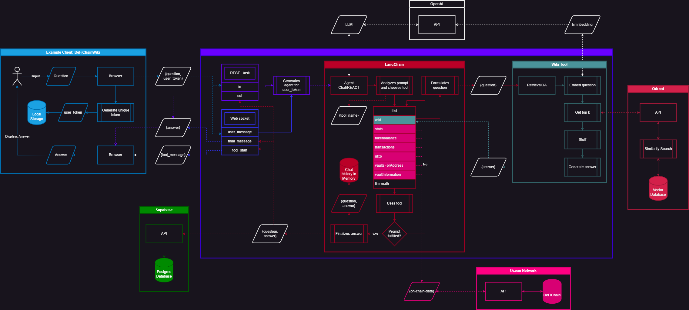

# JellyChat

> https://defichainwiki.com/jellychat

JellyChat is a project that aims to create a chatbot that can answer questions about DeFiChain and its ecosystem.

❗ There are many people which want to learn more about DeFiChain and its ecosystem. However, it is not always easy to find the right information. Also, many people struggle to take in information from various articles in a wiki.

✨ JellyChat aims to solve this by providing the ability for users to interactively ask questions and have an ongoing conversation.

## Main Objectives

- Make learning about DeFiChain fun.
- Be able to answer general questions about DeFiChain and its ecosystem.
- Be able to answer questions involving on-chain data.
- Behave like Jelly (the DeFiChain mascot).
- Feel like a friend that you can ask anything.

## Architecture

This gives a high-level overview of the architecture. It will be extended as the project progresses.

## Key Components

The Repository contains the following key components.

### 🌐 `/backend`

The backend is a Flask API that receives questions and returns answers. It uses a LangChain agent to analyze the question and then uses various tools to best answer the question.

[Details 🔎](./backend/Readme.md)

### 💽 `/data`

We use Supabase to store all questions and final answers together with their rating.

[Details 🔎](./data/Readme.md)

### ⚡️ `/job`

Contains scripts that are executed periodically. Currently, it contains a script that scrapes defichainwiki.com and creates embeddings for each document. The embeddings are saved to Qdrant.

[Details 🔎](./job/Readme.md)
