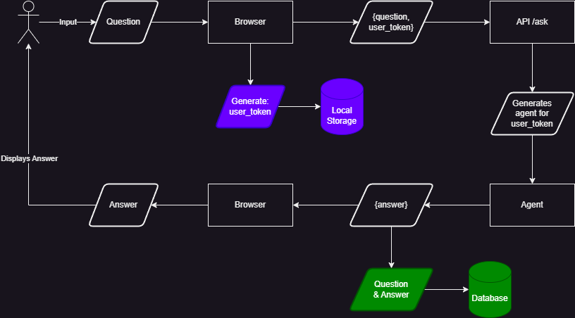

# ChatDeFiChain

## 1. `/job`

Code related to scraping defichainwiki.com and creating an index, which then can be used to answer DeFiChain-specific questions.

- Python
- GPT-Index
- OpenAI API

[Details 🔎](./job/Readme.md)

## 2. `/backend`

Rest API backend which can retrieve questions and will answer with the gathered knowledge out of defichainwiki.com.

- Python
- Flask
- OpenAI API

[Details 🔎](./backend/Readme.md)

## 2. `/frontend`

Lightweight web-client where people can enter questions. Calls the backend API.

- HTML, CSS, JS
- Alpine.js

[Details 🔎](./frontend/Readme.md)

## Possible Knowledge Sources

- [defichainwiki.com](https://www.defichainwiki.com/)
- [Example scraping Wikipedia](https://github.com/openai/openai-cookbook/blob/main/examples/fine-tuned_qa/olympics-1-collect-data.ipynb)
